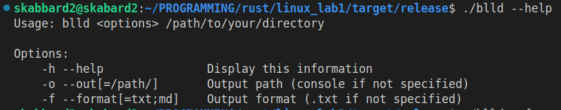
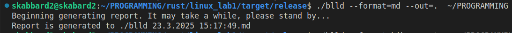
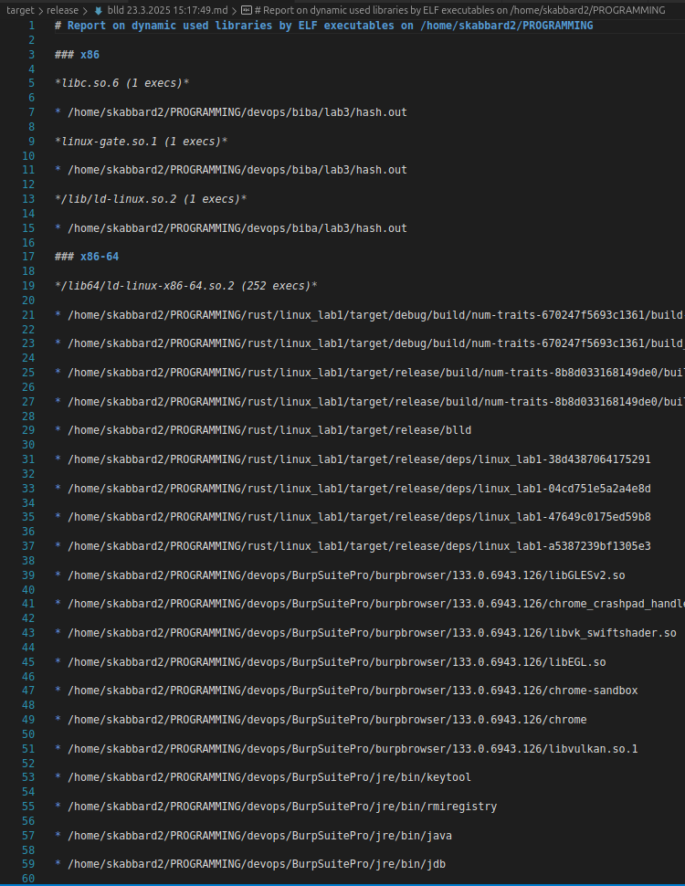
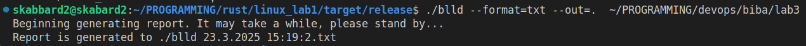
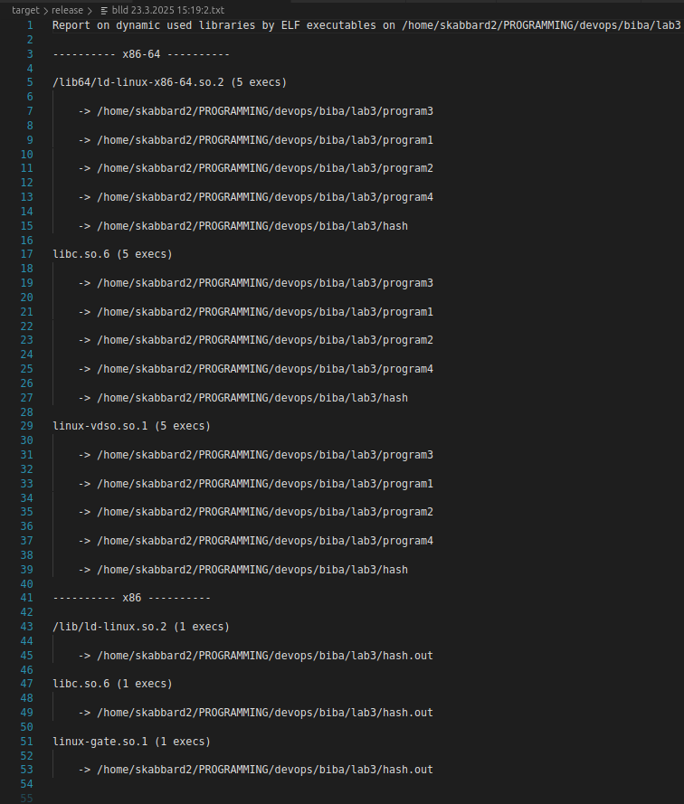
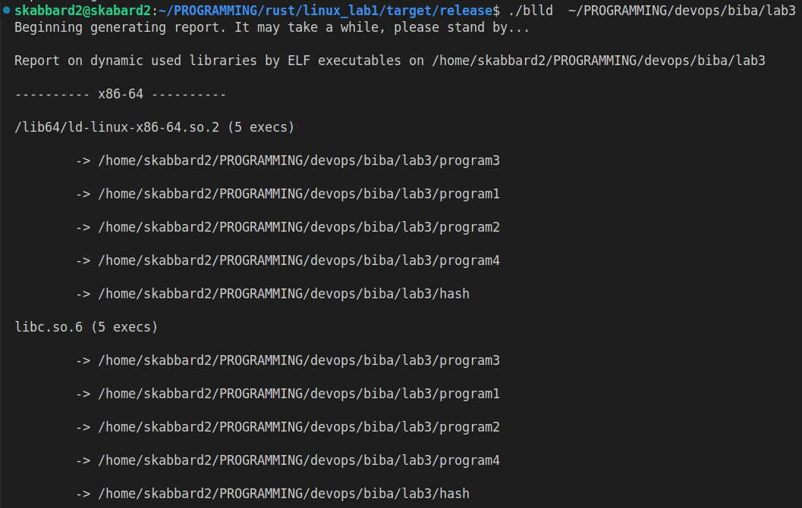

# bldd

### Download

[x86-64 build](https://github.com/dinaraparanid/bldd/releases)

### Features

* Multiarchitecture support (x86, x86-64, armv7, aarch64)

* Help menu

* Error handling

* Generating Markdown report

* Generating txt report

* Generating console output
